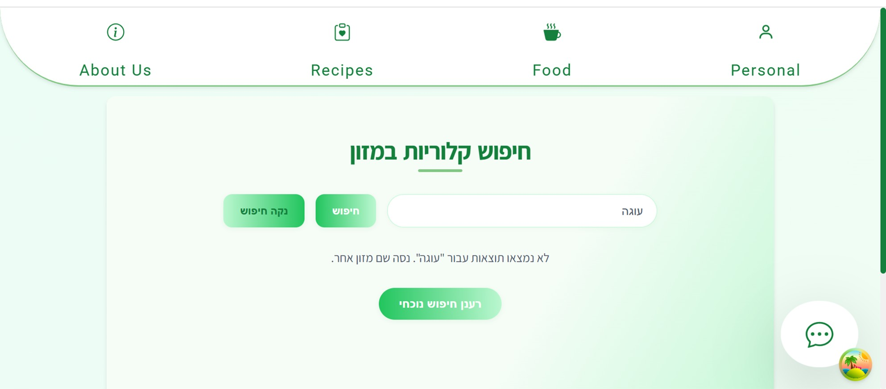
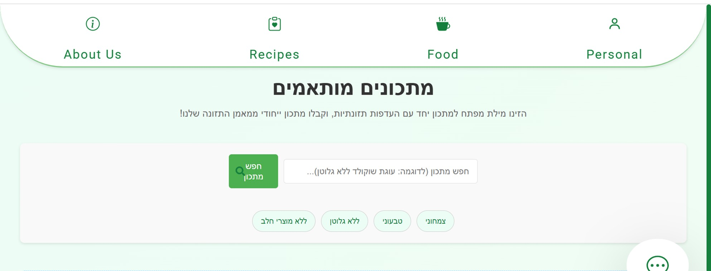

<p align="center">
  
</p>

<h1 align="center">Live Healthy</h1>

<p align="center">
  A personalized nutrition coaching web application.<br/>
  Search recipes by keywords, save favorites, and interact with an AI-based nutrition coach tailored to your chosen style.<br/>
  <a href="#about-the-project"><strong>Explore the docs »</strong></a> ·
  <a href="https://github.com/YochevedRot/live-healthy/tree/main/images">View Screenshots</a>
</p>


---

## About The Project

**Live Healthy** is a full-stack nutrition coaching system focused on personalization and a clean user experience.

### Features
- 🥗 Free-text recipe search  
- ⭐ Favorites system  
- 💬 AI-based personal nutrition trainer  
- 🧩 Modern full-stack architecture (React + .NET Core + SQL Server)

---

## 🧩 Built With

- **Frontend:** ⚛️ React (Vite)
- **Backend:** 🧱 .NET 8 Web API (C#) + Entity Framework Core  
- **Database:** 🗄️ SQL Server  
- **AI Integration:** 🤖 OpenAI GPT API

---

## 🖼️ Screenshots

| Login | Search Recipes | Favorites |
|--------|----------------|------------|
|  |  |  |


## Getting Started

#### 1️⃣ Clone the repository
```bash
git clone https://github.com/yourusername/live-healthy.git
cd live-healthy
```

#### 2️⃣ Install client dependencies and run
```bash
cd Live_healthy-client
npm install
npm run dev
```

 #### 3️⃣ Setup and run the server
```bash
cd ../live_healthy-server
dotnet restore
dotnet build
```
Create a your GPT key and store it in Enviroment Variables:
```bash
OPENAI_API_KEY=your_api_key_here
```

 #### 4️⃣ Configure and initialize the database
If migrations already exist (the Migrations folder is present):
```bash
dotnet tool install --global dotnet-ef
```
if not already installed
```bash
dotnet ef database update
```
If there are no migrations yet:
```bash
dotnet ef migrations add InitialCreate
dotnet ef database update
```

Ensure your appsettings.json contains a valid connection string:
```bash
{
  "ConnectionStrings": {
    "DefaultConnection": "Server=(localdb)\\\\mssqllocaldb;Database=LiveHealthyDb;Trusted_Connection=True;MultipleActiveResultSets=true"
  }
}
```

#### 5️⃣ Run the server
```bash
dotnet run
```

##  Usage
1. Open the client at [http://localhost:5173](http://localhost:5173)
2. Sign up or log in to your account.
3. Search for recipes by typing any keyword.
4. Save your favorite recipes and interact with your AI nutrition coach.
5. Manage your diet plan and explore suggestions from GPT.

##  License
This project is private and may not be copied or redistributed without permission.

